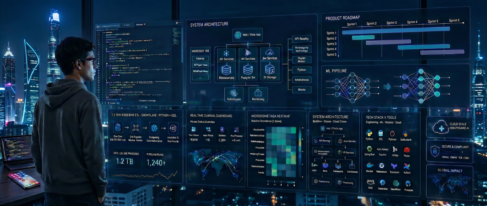

<h1 align="center">Hi, I'm Apoorva Kumar 👋</h1>

 

  
  
  
  

  

---

### 🙋 About Me

I am an **AI/ML and Full Stack Developer** pursuing a Master's in Computer Science at Arizona State University. I've been coding since the second grade, and I'm passionate about leveraging technology to build innovative solutions that empower users.

- 🏫 **Master's in Computer Science** @ Arizona State University (GPA: 3.6/4.0) : Graduating May 2026
- 🎓 **B.Tech in Computer Science & Engineering** @ Visvesvaraya National Institute of Technology (VNIT), Nagpur
- 🛠️ **Technical Assistant** @ City of Tempe
- 💼 Previously @ **Wells Fargo · Shiprocket · Cisco Talent Outreach Program**
- 🏆 **Wells Fargo Spotlight Award** | Cisco Talent Outreach Selectee @ age 16 | ASU Graduate College Scholarship awardee | HP CodeWars 2018
- 🧑‍🏫 Former **C++ Bootcamp Coach** @ College Time | Former Technical Secretary @ VNIT & Secretary @ ACM Student Chapter
- ✍️ Apart from technical interests, I like volunteering for social causes, running marathons, playing soccer and tennis.
- 🌎 Based in **Tempe, Arizona, USA**
- 💬 Feel free to reach out to me for any open roles, discussions or a casual conversation.
- 📬 Open to **Full-Time Roles** in AI/ML, Software Engineering, Data Analytics, Technical Program Management and Product Management.

---

### 🛠️ Tech Stack

**💻 Languages**

**🤖 AI & Machine Learning**

**🧰 Frameworks & Libraries**

**☁️ Cloud & DevOps**

**🗄️ Databases & Tools**

**🤝 Soft Skills**

---

### 📬 Let's Connect

  <a href="https://www.linkedin.com/in/apoorvakumar21/"><b>LinkedIn</b></a> •
  <a href="mailto:apoorvakumar2101@gmail.com"><b>apoorvakumar2101@gmail.com</b></a> •
  <a href="https://www.instagram.com/aknz21/"><b>Instagram</b></a> •
  <a><b>+1 602-784-9691</b></a> 

